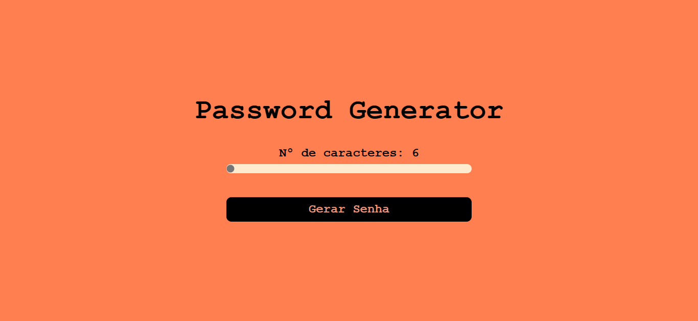

<h1 align="center"> Password Generator </h1>

O projeto consiste em uma página de gereção de senhas automáticas, onde o usuário informa o número de caracteres que deseja na senha em seguida ao clicar em "Gerar Senha" a senha é exibida. 

  <a href="#technologies">Technologies</a>&nbsp;&nbsp;&nbsp;|&nbsp;&nbsp;&nbsp;
  <a href="#project">Project</a>

 

  

## 🚀 Technologies

Esse projeto foi desenvolvido com as seguintes tecnologias:

- HTML e CSS
- JavaScript
- Git e Github

## 💻 Project

- [Visite o projeto online](https://passwordgenerator-raulrodmo.netlify.app/)

---

Made with 💜 by raulrodmo

